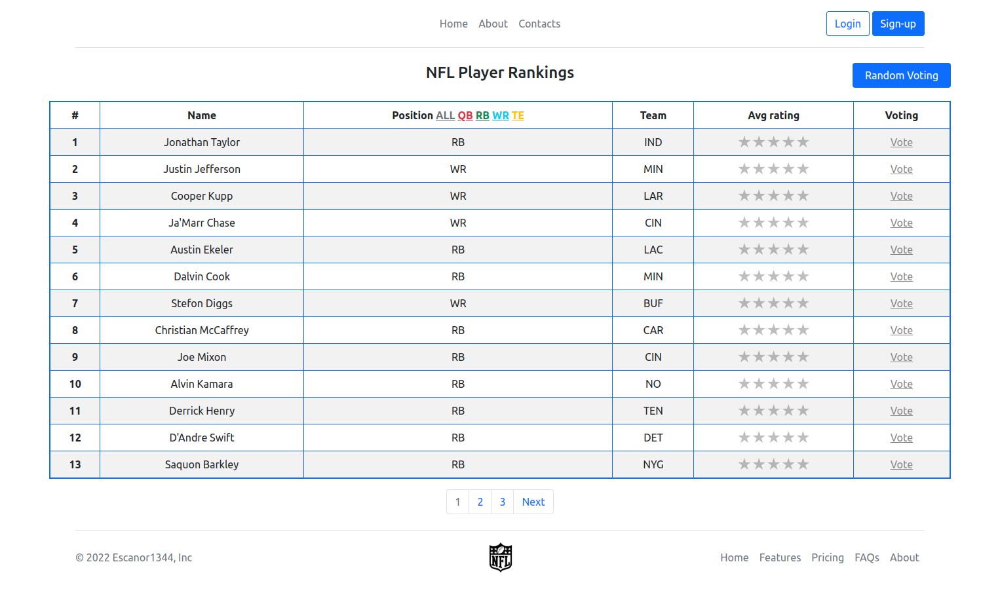
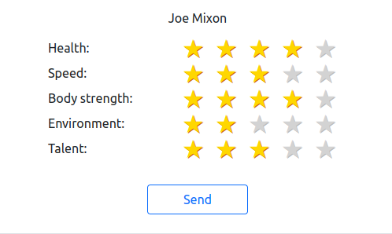
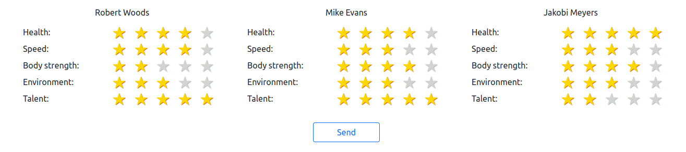
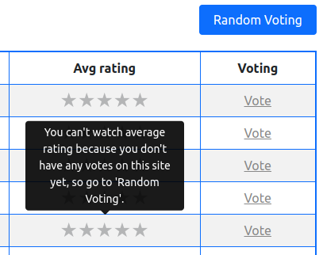

## About The Project
___

This pet project, called "**NFL Player Rankings**", was written as a supplement to a resume.
The site has a voting system for players based on 5 key metrics, namely:
+ health :medical_symbol:
+ speed :runner:
+ body_strength :muscle:
+ strength_environment :busts_in_silhouette:
+ talent :crown:	

You have the right to choose who you want to vote for.
However, you cannot vote for the same player more than once every 4 days.

Also, the site implements the function of random voting. Once a week you will be given the opportunity
to vote for three random players who will be selected by the system.

However, if you are a new user, you must also take a random vote.

While random voting is available — you cannot view the average rating of players and vote for whoever you want.

*Like an example:*

As soon as all the conditions are met — all the features of the site become available to you.

### Built With

+ 
+ 
+ 
+ 
+ 
+ 
