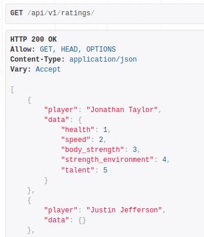

## About The Project
___

NFL Player rankings project was created as an addition for my CV to showcase my professional skills. The site has a 
voting system with 5 key, metrics such as:
+ health :medical_symbol:
+ speed :runner:
+ body_strength :muscle:
+ strength_environment :busts_in_silhouette:
+ talent :crown:	

You have the opportunity to choose any player you want to vote for.
However, you cannot vote for the same player more than once in four days.

Also, the site implements the function of random voting. Once a week you will be given the opportunity
to vote for three random players who will be selected by the system.

However, if you are a new user, you must also take a random vote.

While random voting is available — you cannot view the average rating of players and vote for whoever you want.

*Like an example:*

As soon as all the conditions are met — all the features of the site become available to you.

## What can I do and what features implemented on the site?
___
1. Registration and authorization system using **django.contrib.auth**.
2. Registration and authorization using social networks **Google** and **Facebook** (using *django-allauth* **or** *social_django*).
3. Using Periodic Tasks with **Celery** (including **Docker** and **Redis**) to make a mailing when 7 days have passed and user 
   can make a random choice again.
4. **Django REST framework** was used for creating API.
5. Site was stylized with **Bootstrap 5**, **HTML** and **CSS**.
6. Website written in **functional programming** and **OPP** to show how I work with each paradigm.
7. The site uses Django features such as *formsets, custom template tags and filters, signals, messages framework* and so on.
8. Maintaining the correct project structure, like separation of business logic from models and views into *services.py*. 
9. Website with NFL stats was parsed into **PostgresQL** with **BeautifulSoup**.

## API documentation
___

There are three main url address:

+ *http://127.0.0.1:8000/api/v1/players/*  — show all player with their position, current team and ID in db.

+ *http://127.0.0.1:8000/api/v1/ratings/*  — provides you to get all player with their average rating by each metric.

+ *http://127.0.0.1:8000/api/v1/ratings/<position>/* — provides all filtered players by position (position should be one of the following list 'QB/WR/RB/TE').

### Built With
+ 
+ 
+ 
+ 
+ 
+ 
+ 
